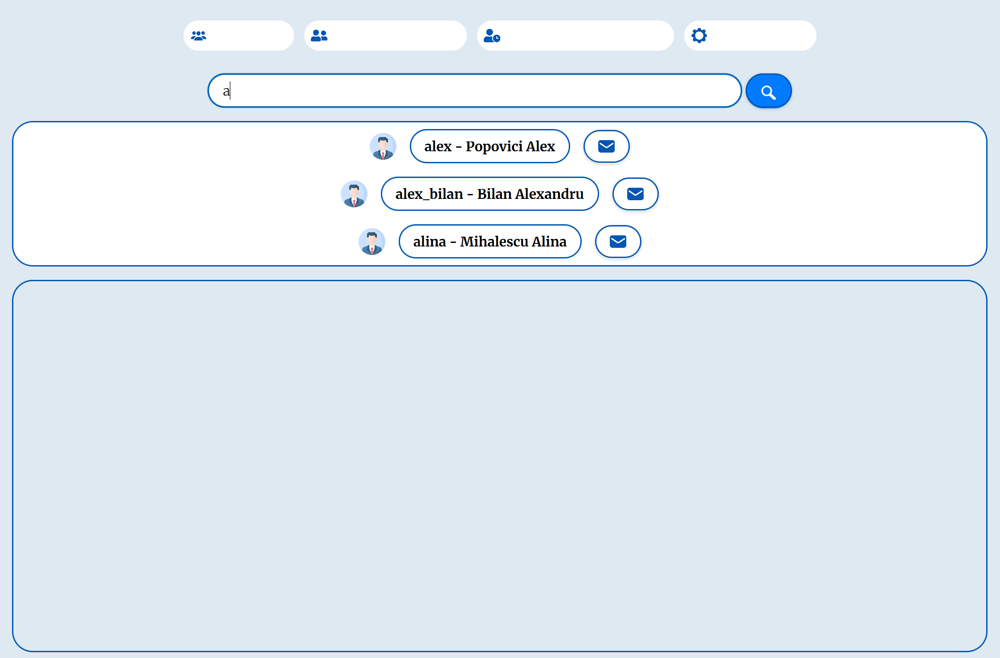

# SocialNetworkGUI

## Overview

SocialNetworkGUI is a Java-based social networking application with a JavaFX graphical user interface. It allows users to connect, communicate, and share content in an interactive and user-friendly environment. The app includes features like user authentication, content sharing, real-time notifications, and network exploration. Additionally, it integrates machine learning for functionalities such as spam detection and content recommendations.


## Images

### First Page


### Login


### Friends List


### Friend Requests


### Messages


### Search Bar


### Settings


## Features

- **User Registration & Login:** Secure authentication system with user profiles.
- **Post Sharing:** Users can share text, images, and multimedia content.
- **Feed System:** Personalized user feed based on interactions.
- **Real-time Notifications:** Get notified of new posts, messages, and activities.
- **Spam Detection:** Machine learning model to filter and identify spam content.
- **Recommendation Engine:** Personalized content suggestions using collaborative filtering.
- **Search Functionality:** Users can search for other users, posts, and tags.
- **Interactive GUI:** Built with JavaFX for a smooth and modern user experience.

## Tech Stack

- Java 8+ for backend logic
- JavaFX for GUI
- PostgreSQL for data storage
- Maven for dependency management

## Installation

### Prerequisites

Ensure the following are installed on your machine:

- Java 8+
- Maven (for project management)
- PostgreSQL (or any compatible database system)
- Git (for cloning the repository)

### Step-by-Step Installation

1. **Clone the repository:**

   ```bash
   git clone https://github.com/mariusvicol/SocialNetworkGUI.git
   cd SocialNetworkGUI
